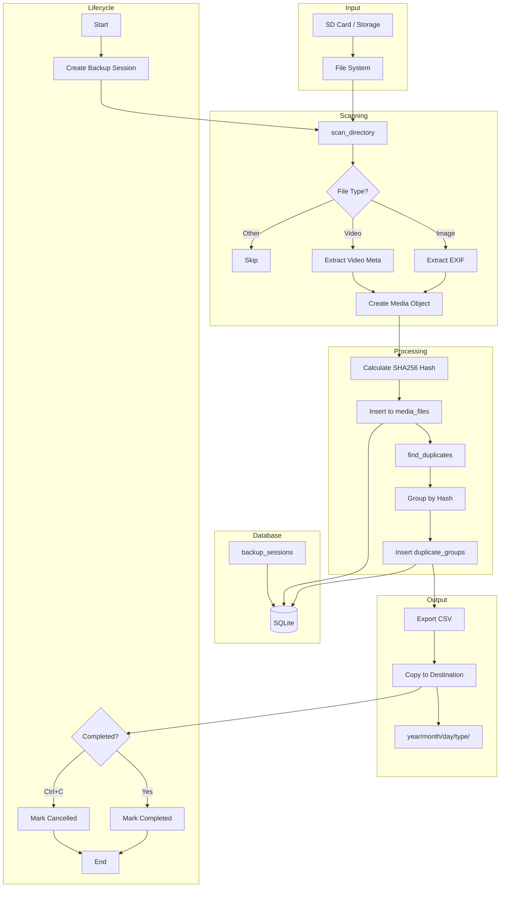
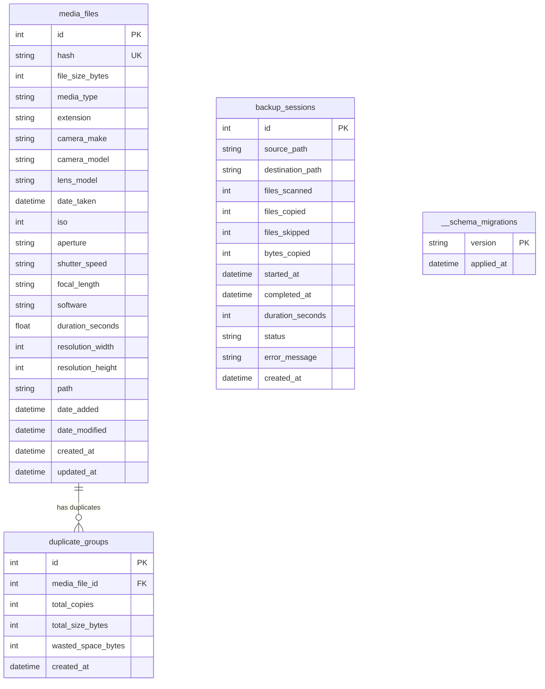
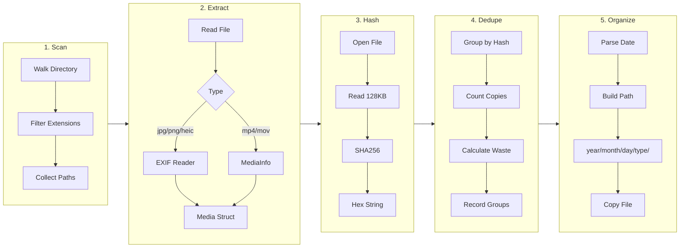

# Photo App RS - Architecture

A Rust-based photo and video management system for organizing media files from SD cards and storage devices.

---

## Table of Contents

- [Overview](#overview)
- [Project Structure](#project-structure)
- [Data Flow](#data-flow)
- [Module Breakdown](#module-breakdown)
- [Database Schema](#database-schema)
- [Dependencies](#dependencies)
- [Design Patterns](#design-patterns)

---

## Overview

| Aspect | Description |
|--------|-------------|
| **Purpose** | Organize media files into structured directories, detect duplicates, extract metadata |
| **Language** | Rust |
| **UI Framework** | Iced (MVU pattern) |
| **Database** | SQLite (rusqlite) |
| **Architecture** | Synchronous I/O with signal-based graceful shutdown |

---

## Project Structure

```
photo_app_rs/
├── Cargo.toml                    # Workspace root
├── src/
│   └── main.rs                   # Iced GUI (placeholder)
│
├── analytics/                    # Core application
│   ├── Cargo.toml
│   └── src/
│       ├── main.rs               # Entry point & orchestration
│       ├── lib.rs
│       ├── database/
│       │   ├── mod.rs
│       │   ├── connection.rs     # DB init & connection
│       │   ├── migrations.rs     # Schema versioning
│       │   ├── models.rs         # Data structures
│       │   ├── operations.rs     # CRUD operations
│       │   └── migrations/
│       │       └── 001_initial_schema.sql
│       └── utils/
│           ├── mod.rs
│           ├── core.rs           # File scanning & metadata
│           └── duplicates.rs     # Hash-based deduplication
│
└── misc/                         # Utility binaries
    ├── Cargo.toml
    └── src/
        ├── lib.rs
        └── bin/
            └── extract_meta.rs   # Video metadata testing
```

---

## Data Flow



---

## Module Breakdown

### 1. Analytics Package (Core)

#### `main.rs` - Orchestration
```
Responsibilities:
├── Initialize database connection
├── Create backup session record
├── Set up Ctrl+C signal handler
├── Coordinate scanning → processing → export
├── Calculate wasted space statistics
└── Update session status on completion
```

#### `database/` - Persistence Layer

| File | Purpose |
|------|---------|
| `connection.rs` | Initialize SQLite, enable foreign keys, run migrations |
| `migrations.rs` | Version-controlled schema changes with tracking table |
| `models.rs` | `MediaFileRow`, `DuplicateGroupRow`, `BackupSessionRow` |
| `operations.rs` | Insert media, manage sessions, record duplicates |

#### `utils/` - Core Logic

| File | Key Functions |
|------|---------------|
| `core.rs` | `scan_directory()`, `Media::new()`, `FileType::from_path()` |
| `duplicates.rs` | `find_duplicates()`, `calculate_hash()`, `final_path_for_media()` |

### 2. GUI Package (Root)

```rust
// Iced MVU Architecture
struct Counter { value: i32 }
enum Message { Increment, Decrement }
fn update(counter: &mut Counter, message: Message)
fn view(counter: &Counter) -> Element<Message>
```

### 3. Misc Package

- `extract_meta.rs`: Standalone binary for testing video metadata extraction

---

## Database Schema



### Indices

| Table | Index | Columns |
|-------|-------|---------|
| media_files | idx_media_files_hash | hash |
| media_files | idx_media_files_date_taken | date_taken |
| media_files | idx_media_files_media_type | media_type |
| media_files | idx_media_files_path | path |
| duplicate_groups | idx_duplicate_groups_media_file_id | media_file_id |
| backup_sessions | idx_backup_sessions_status | status |
| backup_sessions | idx_backup_sessions_started_at | started_at |

---

## Dependencies

| Crate | Version | Purpose |
|-------|---------|---------|
| `iced` | 0.14.0 | Cross-platform GUI framework |
| `rusqlite` | 0.38.0 | SQLite database driver |
| `kamadak-exif` | 0.6.1 | EXIF metadata extraction |
| `media_info` | 0.6.0 | Video metadata (duration, resolution) |
| `sha2` | 0.10.9 | SHA256 hashing for deduplication |
| `chrono` | 0.4.42 | Date/time handling |
| `csv` | 1.3 | CSV export |
| `serde` | 1.0 | Serialization |
| `ctrlc` | 3.4 | Graceful shutdown signals |

---

## Design Patterns

### Repository Pattern
```
database/operations.rs encapsulates all DB operations
├── new_backup_session()
├── insert_media_file()
├── insert_duplicate_group()
├── mark_session_completed()
└── mark_session_cancelled()
```

### Factory Pattern
```
FileType::from_path(path) → FileType
Media::new(path) → Media
```

### Migration Pattern
```
Version-controlled schema with __schema_migrations
├── Check applied versions
├── Apply pending migrations in order
└── Track each application timestamp
```

### Signal Handling
```rust
Arc<Mutex<Option<i64>>>  // Thread-safe session ID
ctrlc::set_handler()     // Capture Ctrl+C
mark_session_cancelled() // Clean shutdown
```

---

## Processing Pipeline Detail



---

## File Organization Output

```
destination/
├── 2024/
│   ├── 01/
│   │   ├── 15/
│   │   │   ├── images/
│   │   │   │   ├── IMG_001.jpg
│   │   │   │   └── IMG_002.heic
│   │   │   └── videos/
│   │   │       └── VID_001.mp4
│   │   └── 16/
│   │       └── images/
│   │           └── IMG_003.png
│   └── 02/
│       └── ...
└── 2023/
    └── ...
```

---

## Concurrency Model

```
┌─────────────────────────────────────────┐
│              Main Thread                │
├─────────────────────────────────────────┤
│  ┌─────────────────────────────────┐    │
│  │     Arc<Mutex<session_id>>      │◄───┼── Shared state
│  └─────────────────────────────────┘    │
│                  │                      │
│    ┌─────────────┴─────────────┐        │
│    ▼                           ▼        │
│  Normal                    Ctrl+C       │
│  Execution                 Handler      │
│    │                           │        │
│    ▼                           ▼        │
│  mark_completed()      mark_cancelled() │
└─────────────────────────────────────────┘

Note: Single-threaded synchronous I/O
      No async runtime or thread pool
```

---

## Configuration

| Setting | Current Value | Location |
|---------|---------------|----------|
| Source Path | `/Users/saujanya/sandisk_media` | `analytics/src/main.rs` |
| Database | `./.photo_app_rs/sqlite.db` | `database/connection.rs` |
| CSV Export | `./csv_exports/final_export.csv` | `analytics/src/main.rs` |
| Destination | `{source}/final_export` | `analytics/src/main.rs` |
| Hash Size | 128 KB (partial file) | `utils/duplicates.rs` |

---

## Supported Formats

### Images
`jpg`, `jpeg`, `png`, `gif`, `bmp`, `tiff`, `webp`, `heic`, `heif`, `raw`, `cr2`, `nef`, `arw`, `dng`

### Videos
`mp4`, `mov`, `avi`, `mkv`, `wmv`, `flv`, `webm`, `m4v`, `3gp`

---

## Future Considerations

- [ ] Async I/O with tokio for parallel processing
- [ ] Rayon for parallel file hashing
- [ ] Configuration file support (TOML/YAML)
- [ ] Full GUI implementation
- [ ] Cloud backup integration
- [ ] Face detection / ML-based organization
